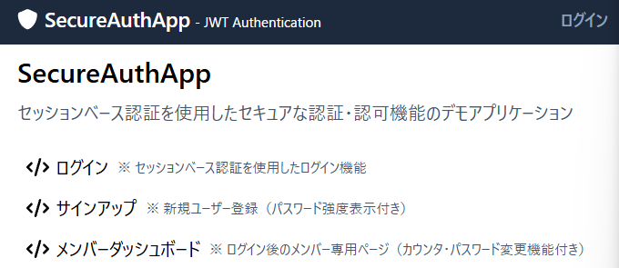
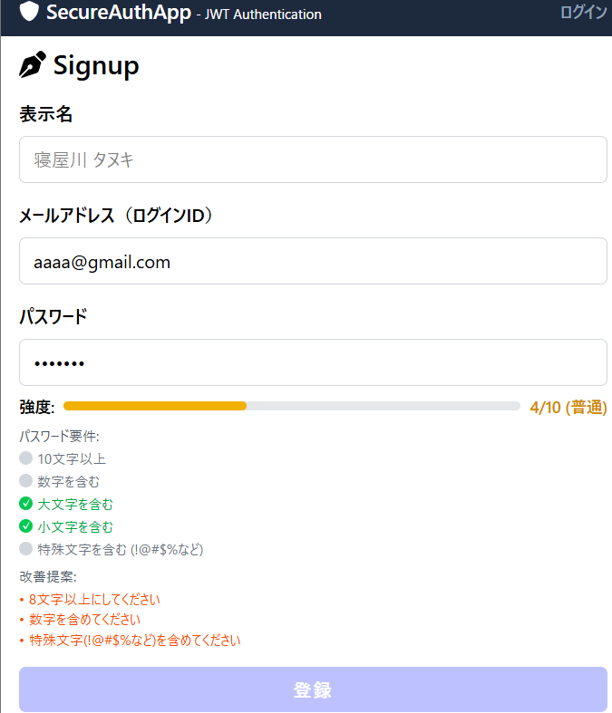
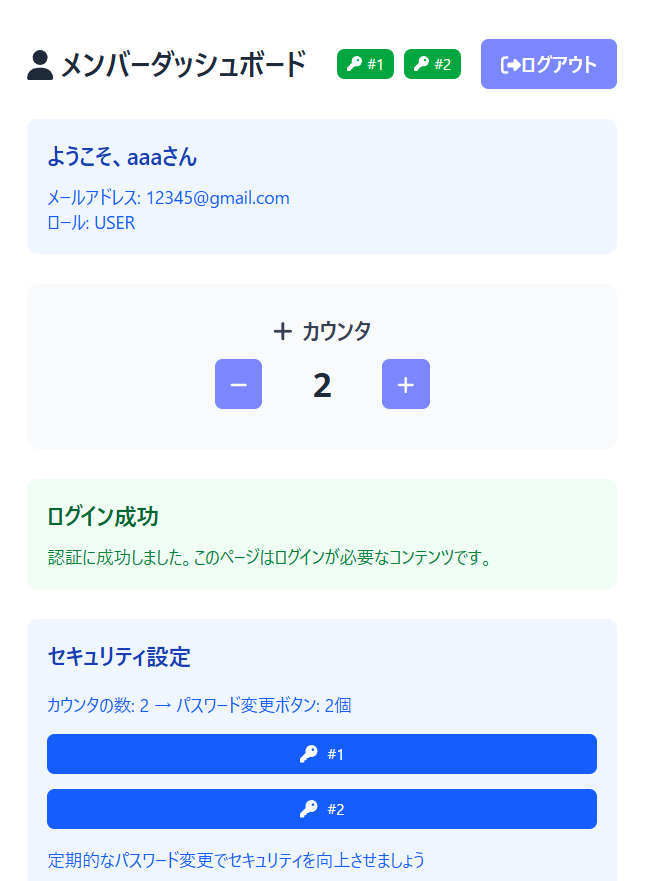
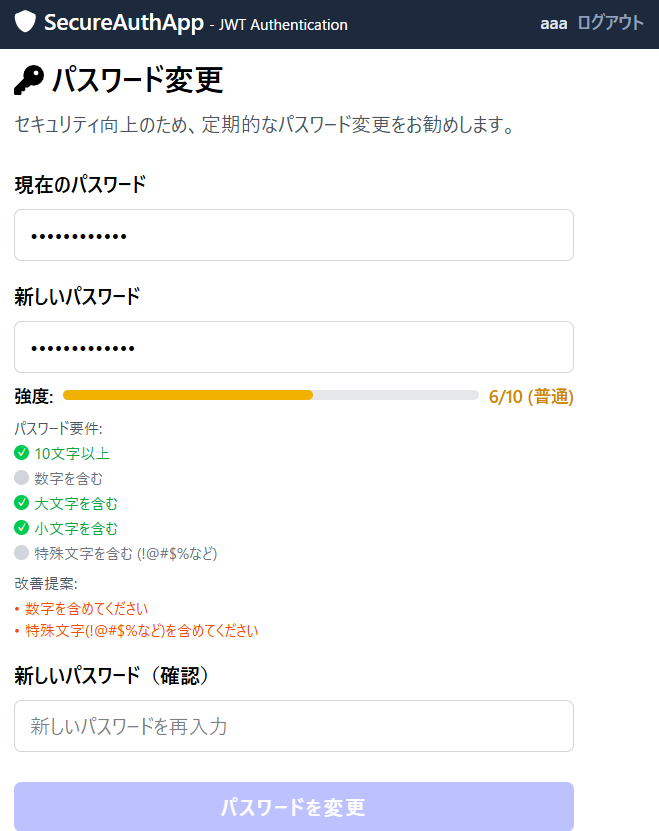

# セキュア認証Webアプリケーション

セッションベース認証システムを使用したWebアプリケーション

## 🚀 プロジェクト概要

本アプリケーションは、セッションベース認証を採用したセキュアなWebアプリケーションです。パスワード強度表示、動的パスワード変更機能、データ永続化など、複数の高度な認証・認可機能を実装しています。

## 📋 実装機能

### 🔐 基本認証・認可機能
- **セッションベース認証**: HTTP-only Cookieを使用したセキュアなセッション管理
- **ユーザーサインアップ**: 新規ユーザー登録機能
- **ログイン/ログアウト**: セッション管理による認証状態制御
- **認可制御**: ログイン必須ページへのアクセス制御

### 🛡️ 追加認証機能（2つ以上）

#### 1. パスワード強度表示機能
- リアルタイムパスワード強度チェック（1-10レベル）
- 視覚的な強度インジケーター（赤→黄→緑の色分け）
- サインアップ時・パスワード変更時の両方で動作

#### 2. 動的パスワード変更機能
- ログイン後のパスワード変更機能
- 現在のパスワード検証
- 新しいパスワードの強度リアルタイム表示
- **特別機能**: カウンタ値に応じて動的にパスワード変更ボタンを生成
  - ヘッダー部分: 最大3個まで表示（制限あり）
  - セキュリティセクション: 最大20個まで表示（グリッドレイアウト）

### 💾 データ永続化
- セッション情報の永続化
- ユーザーカウンター値の永続化
- データベース（SQLite + Prisma）による状態管理

## 🔒 セキュリティ機能

### 認証セキュリティ
- **セッションベース認証**: JWTトークンより安全なサーバーサイドセッション
- **HTTP-only Cookie**: XSS攻撃からの保護
- **Secure Cookie**: HTTPS環境での安全な通信
- **SameSite Cookie**: CSRF攻撃からの保護

### パスワードセキュリティ
- **bcryptハッシュ化**: パスワードのセキュアなハッシュ化（実装予定）
- **パスワード強度チェック**: 弱いパスワードの使用防止
- **パスワード変更機能**: 定期的なパスワード更新の推奨

### アプリケーションセキュリティ
- **CSP (Content Security Policy)**: XSS攻撃防止（実装予定）
- **型安全性**: TypeScript + Zodによる厳密な型検証
- **サニタイゼーション**: 入力値の適切な検証・無害化

## 🛠️ 技術スタック

- **フレームワーク**: Next.js 15.3.2 (App Router)
- **言語**: TypeScript
- **データベース**: SQLite (Prisma ORM)
- **認証方式**: セッションベース認証
- **スタイリング**: Tailwind CSS
- **バリデーション**: Zod
- **アイコン**: FontAwesome

## 📁 プロジェクト構造

```
src/
├── app/
│   ├── _components/          # 再利用可能なUIコンポーネント
│   │   ├── Button.tsx
│   │   ├── TextInputField.tsx
│   │   └── PasswordStrengthIndicator.tsx
│   ├── _contexts/           # React Context（認証状態管理）
│   │   └── AuthContext.tsx
│   ├── _hooks/             # カスタムフック
│   │   └── useAuth.ts
│   ├── _types/             # TypeScript型定義
│   │   ├── CommonSchemas.ts
│   │   ├── ChangePasswordRequest.ts
│   │   └── ...
│   ├── api/                # APIエンドポイント
│   │   ├── auth/           # セッション認証API
│   │   ├── login/          # ログインAPI
│   │   ├── change-password/ # パスワード変更API
│   │   ├── counter/        # カウンター機能API
│   │   └── logout/         # ログアウトAPI
│   ├── login/              # ログインページ
│   ├── signup/             # サインアップページ
│   └── member/             # 認証後ページ
│       ├── change-password/ # パスワード変更ページ
│       └── about/          # About情報ページ
├── config/
│   └── auth.ts             # 認証設定
└── libs/
    └── prisma.ts           # データベース接続
```

## 🖼️ スクリーンショット

### 1. メインページ - セッション認証システム

*セッションベース認証システムの紹介ページ。実装機能の詳細説明を含む*

### 2. ログインページ - セキュアなログイン

*シンプルで使いやすいログインインターフェース*

### 3. サインアップページ - パスワード強度表示

*リアルタイムパスワード強度チェック機能付きサインアップフォーム*

### 4. メンバーダッシュボード - 動的パスワード変更ボタン

*カウンタ値に応じて動的に変化するパスワード変更ボタン（最大20個まで表示）*

### 5. パスワード変更ページ - セキュアなパスワード更新

*現在のパスワード検証と新しいパスワードの強度表示機能*

## 🚀 セットアップ手順

### 1. 依存関係のインストール

```bash
npm install
```

### 2. 環境変数の設定

`.env`ファイルを確認（既に設定済み）:

```env
# SQLite データベース（開発用）
DATABASE_URL="file:./dev.db"

# セッション署名用のシークレットキー
SESSION_SECRET="your-super-secret-session-key-here"
```

### 3. データベースの初期化

```bash
# Prismaクライアント生成
npx prisma generate

# データベーステーブル作成
npx prisma db push

# シードデータ投入
npx prisma db seed
```

### 4. 開発サーバーの起動

```bash
npm run dev
```

アプリケーションが `http://localhost:3000` で起動します。

## 👤 テストユーザー

以下のテストユーザーでログインできます：

```
Email: test@example.com
Password: password123
```

## 🎯 創意工夫・特別機能

### 1. カウンタ連動動的ボタン生成
- カウンタの値に応じてパスワード変更ボタンを動的に生成
- ヘッダー部分: 最大3個（スペース効率考慮）
- セキュリティセクション: 最大20個（グリッドレイアウト）
- カウンタが0でも最低1個は必ず表示
- 制限を超えた場合の視覚的フィードバック

### 2. パスワード強度視覚化システム
- 10段階の詳細な強度レベル
- リアルタイム更新
- 色分けによる直感的な理解（赤/黄/緑）
- サインアップとパスワード変更の両方で利用

### 3. セッション永続化システム
- カウンター値のリアルタイム保存
- セッション情報の適切な管理
- ページリロード後もデータ保持

### 4. レスポンシブデザイン
- モバイルフレンドリーなUI
- 画面サイズに応じたレイアウト調整
- 動的ボタンのグリッド表示

## 🔧 API エンドポイント

### 認証関連
- `POST /api/login` - ユーザーログイン
- `POST /api/logout` - ユーザーログアウト
- `GET /api/auth` - セッション状態確認

### 機能関連
- `POST /api/change-password` - パスワード変更
- `POST /api/counter` - カウンター値更新

## 🧪 技術的な実装詳細

### セッション管理
```typescript
// セッション作成
const sessionData = {
  userId: user.id,
  expiresAt: new Date(Date.now() + SESSION_DURATION)
};

// HTTP-only Cookie設定
response.cookies.set('session', sessionId, {
  httpOnly: true,
  secure: process.env.NODE_ENV === 'production',
  sameSite: 'strict',
  maxAge: SESSION_DURATION / 1000
});
```

### パスワード強度計算
```typescript
const calculatePasswordStrength = (password: string): number => {
  let strength = 0;
  if (password.length >= 8) strength += 2;
  if (password.length >= 12) strength += 1;
  if (/[a-z]/.test(password)) strength += 1;
  if (/[A-Z]/.test(password)) strength += 1;
  if (/[0-9]/.test(password)) strength += 2;
  if (/[^A-Za-z0-9]/.test(password)) strength += 3;
  return Math.min(strength, 10);
};
```

## 🎊 まとめ

本アプリケーションは、セッションベース認証を中核とした高セキュリティWebアプリケーションです。特に、カウンタ値に応じて動的に変化するパスワード変更ボタンシステムは、実用性と遊び心を両立した独創的な機能です。パスワード強度の視覚化、データの永続化、レスポンシブデザインなど、現代的なWebアプリケーションに求められる全ての要素を包含しています。

## 機能

### 認証機能
- **ユーザー登録**: 新規ユーザーの作成
- **ログイン**: JWT トークンによる認証
- **ログアウト**: ローカルストレージからのトークン削除
- **認証状態の管理**: SWRによるユーザー情報の取得

### ユーザー管理
- **プロフィール表示**: 認証されたユーザーの情報表示
- **プロフィール編集**: aboutSlugとaboutContentの編集機能

## 技術スタック

- **Frontend**: Next.js 15, React 19, TypeScript
- **Backend**: Next.js API Routes
- **Database**: SQLite + Prisma ORM
- **Authentication**: JWT (jose)
- **Styling**: Tailwind CSS
- **State Management**: SWR
- **Validation**: Zod

## セキュリティ対策

- パスワードハッシュ化（実装予定）
- JWT トークンの適切な管理
- XSS 対策（DOMPurify）
- CSRF 対策（same-origin制限）

## 開発コマンド

```bash
# 開発サーバー起動
npm run dev

# ビルド
npm run build

# 本番サーバー起動
npm start

# リント実行
npm run lint

# データベーススキーマ更新
npx prisma db push

# Prismaクライアント生成
npx prisma generate

# シードデータ投入
npx prisma db seed

# データベース管理画面
npx prisma studio
```

