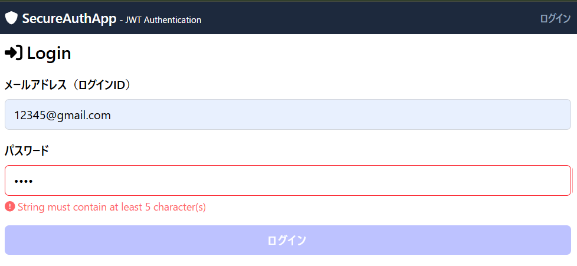

# セキュア認証Webアプリケーション

セッションベース認証システムを使用したWebアプリケーション

## 🚀 プロジェクト概要

本アプリケーションは、セッションベース認証を採用したセキュアなWebアプリケーションです。パスワード強度表示、動的パスワード変更機能、データ永続化など、複数の高度な認証・認可機能を実装しています。

## 📋 実装機能

### 🔐 基本認証・認可機能
- **セッションベース認証**: HTTP-only Cookieを使用したセキュアなセッション管理
- **ユーザーサインアップ**: 新規ユーザー登録機能
- **ログイン/ログアウト**: セッション管理による認証状態制御
- **認可制御**: ログイン必須ページへのアクセス制御

### 🛡️ 追加認証機能（2つ以上）

#### 1. パスワード強度表示機能
- リアルタイムパスワード強度チェック（1-10レベル）
- 視覚的な強度インジケーター（赤→黄→緑の色分け）
- サインアップ時・パスワード変更時の両方で動作

#### 2. 動的パスワード変更機能
- ログイン後のパスワード変更機能
- 現在のパスワード検証
- 新しいパスワードの強度リアルタイム表示
- **特別機能**: カウンタ値に応じて動的にパスワード変更ボタンを生成
  - ヘッダー部分: 最大3個まで表示（制限あり）
  - セキュリティセクション: 最大20個まで表示（グリッドレイアウト）

### 💾 データ永続化
- セッション情報の永続化
- ユーザーカウンター値の永続化
- データベース（SQLite + Prisma）による状態管理
## 🛠️ 技術スタック

- **フレームワーク**: Next.js 15.3.2 (App Router)
- **言語**: TypeScript
- **データベース**: SQLite (Prisma ORM)
- **認証方式**: セッションベース認証
- **スタイリング**: Tailwind CSS
- **バリデーション**: Zod
- **アイコン**: FontAwesome

## 📁 プロジェクト構造

```
src/
├── app/
│   ├── _components/          # 再利用可能なUIコンポーネント
│   │   ├── Button.tsx
│   │   ├── TextInputField.tsx
│   │   └── PasswordStrengthIndicator.tsx
│   ├── _contexts/           # React Context（認証状態管理）
│   │   └── AuthContext.tsx
│   ├── _hooks/             # カスタムフック
│   │   └── useAuth.ts
│   ├── _types/             # TypeScript型定義
│   │   ├── CommonSchemas.ts
│   │   ├── ChangePasswordRequest.ts
│   │   └── ...
│   ├── api/                # APIエンドポイント
│   │   ├── auth/           # セッション認証API
│   │   ├── login/          # ログインAPI
│   │   ├── change-password/ # パスワード変更API
│   │   ├── counter/        # カウンター機能API
│   │   └── logout/         # ログアウトAPI
│   ├── login/              # ログインページ
│   ├── signup/             # サインアップページ
│   └── member/             # 認証後ページ
│       ├── change-password/ # パスワード変更ページ
│       └── about/          # About情報ページ
├── config/
│   └── auth.ts             # 認証設定
└── libs/
    └── prisma.ts           # データベース接続
```

## 🖼️ スクリーンショット

### 1. メインページ - セッション認証システム


### 2. ログインページ - セキュアなログイン

*シンプルで使いやすいログインインターフェース*

### 3. サインアップページ - パスワード強度表示

*リアルタイムパスワード強度チェック機能付きサインアップフォーム*

### 4. メンバーダッシュボード - 動的パスワード変更ボタン

*カウンタ値に応じて動的に変化するパスワード変更ボタン（最大20個まで表示）*

### 5. パスワード変更ページ - セキュアなパスワード更新

*現在のパスワード検証と新しいパスワードの強度表示機能*

